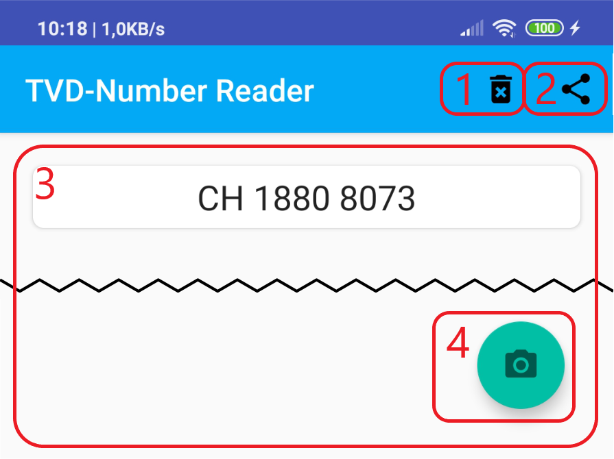
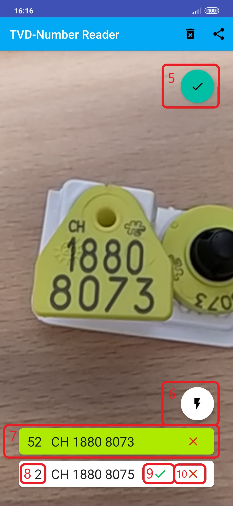
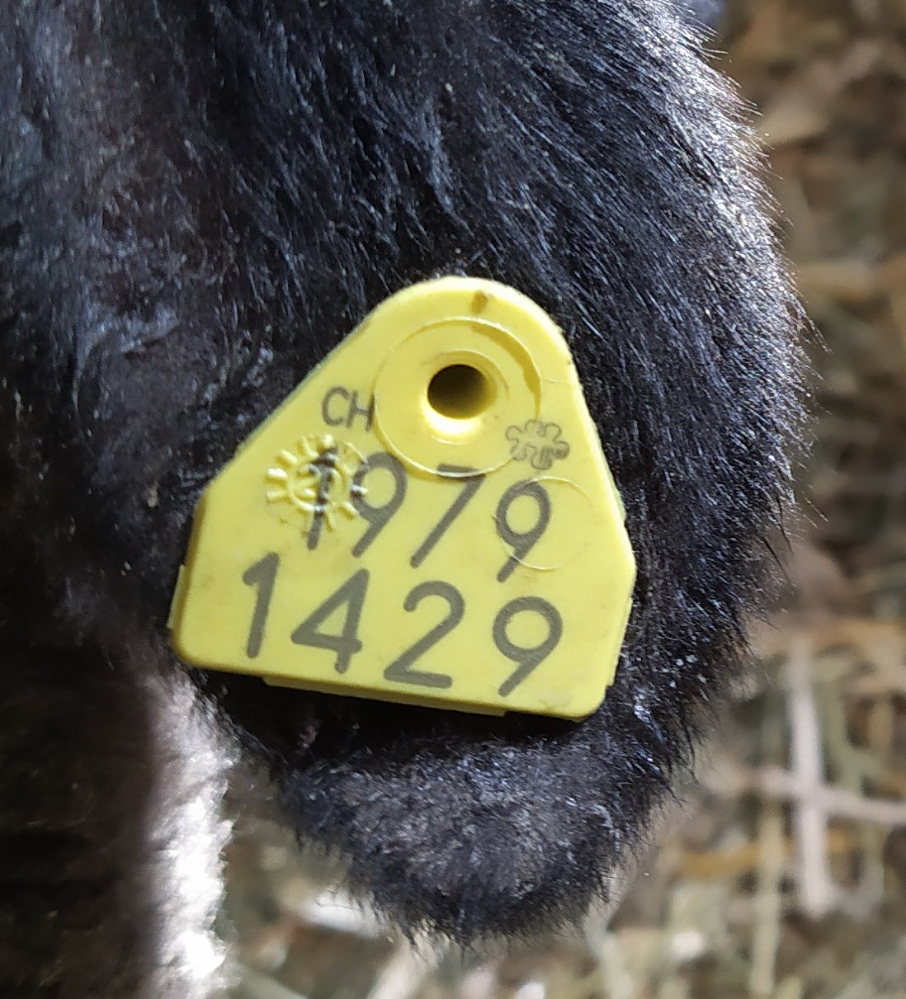
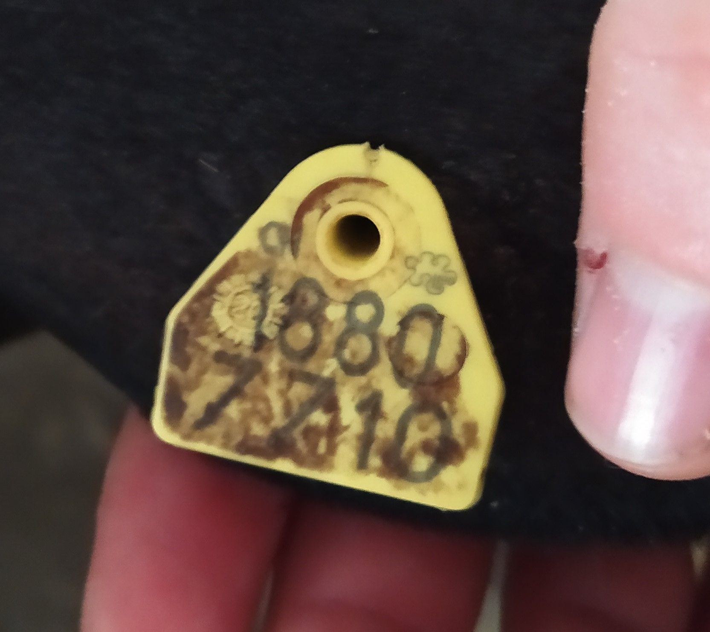

# Eartag-Reader

Reads the Tvdnumber from the earmarks of sheeps

## Using the App

<p align="center">
    
    
</p>

1. Button to delete the list of earmark numbers after confirmation.
2. Button to share the list with capable apps or to save the list.  
**Note:** The first two buttons only appear when at least one earmark is added to the list. 3.
3. Region in which the list is displayed.
4. Button to add more eartag numbers to the list.
The first time, permission is asked to use a camera on the back of the phone.
5. Button to go to the main page after adding eartags.
6. Button to better capture the earmark with the flash light in a dark environment.
7. If an eartag has already been saved, the suggestion is highlighted in green.
8. The number of image analyses that have come up with the same eartag number. The suggestions are sorted according to the number of identical image analyses.
9. Button to add the corresponding earmark number to the list.
10. Button to temporarily remove an earmark number.

## Example Eartaglabel

If you want to test the app here's some images to test the app on.

**Note:** Please be aware that the app has problem recognizing the  text if label is soiled.

<p align="center">
    
    
    
</p>

## Compiling Eartag-Reader

To compile the app after version 1.2.1 (more precisely after [commit e15ae57e9df65d66020e68c4021f91385ceded0d](https://github.com/MankoMR/Eartag-Reader/commit/e15ae57e9df65d66020e68c4021f91385ceded0d) ) it's necessary to add a file called ```keystore.properties``` in the project folder.
Its needed to sign the compiled apk.
Below is the content of ```keystore.properties```.

```properties
## This file must *NOT* be checked into Version Control Systems,
# as it contains information specific to your local configuration.

storeFile={location of jks file for this project}
storePassword={password for jks file}
keyAlias={keyAlias for this project}
keyPassword={password for key}
```
